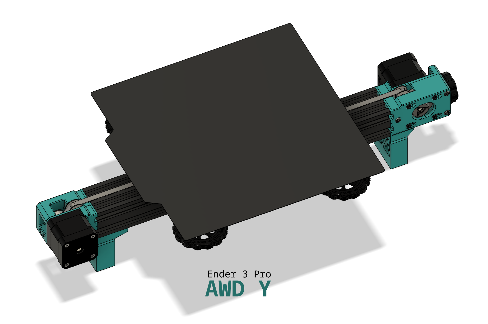

# Ender 3 Pro AWD-Y

Hi, for the new users, this "AWD" mod adds second stepper motor onto your Y axis, doubling the torque available. As you probably noticed stock bed assembly is quite heavy which significantly limits accelerations. 

With double the torque you will be able to print much faster without compromising on quality!

This mod has been heavily inspired by [LH Stinger](https://github.com/lhndo/LH-Stinger/tree/main)

  

[![CC BY-NC-SA 4.0][cc-by-nc-sa-shield]][cc-by-nc-sa]

## Features
- more torque on Y axis -> better acceleration
- easy tensioning
- maximize Y axis travel, as mounts are very low profile (+-280mm)
- support feet to reduce vibrations and prevent [this issue](https://youtu.be/1tBwaWnOHKY?si=pGgoMI5P9Bu9fiOg&t=324).
- toothed idlers
- compatible with [LH Stinger - Ender 3 - CF Carriage](https://discord.com/channels/1167067314781429831/1209625504425054271) as they are very low profile

### Changes over BETA
- 20T GT2 Idlers are now default. I found significant rubbing when using F623 bearings. Belt path has been adjusted.

## FAQ

> Are there build instructions ? 

I am working on them, but for now consult the CAD.

> Can I use single driver / stepper cable splitter ?

This doesn't really make sense, single driver usually does not provide enough to drive two steppers. Same applies to boards with two Z axis cable slots.

> Can I use v-wheels ?

Yes, v-wheels still work. 

## Rigid Mount 

### BOM

| Part                         | Quantity | Comment                                                                               |
| ---------------------------- | -------- | ------------------------------------------------------------------------------------- |
| 20T GT2 Idler                | 1        |                                                                                       |
| 20T GT2 Pulley               | 1        |                                                                                       |
| 625 Bearing (without flange) | 1        | required for double shear, highly recommended                                     |
| M3x30 SHSC                   | 4        |                                                                                       |
| M3x7x0.5 Washer              | 6        |                                                                                       |
| M5x10 BHSC                   | 4 + 2    | 4 button head screws are required to fit into mounting slots, 2 if using support foot |
| M5 T-Nut                     | 2        | required only if using support foot                                                   |
| M5x10x0.5 Washer             | 1        | required for double shear, outer diameter doesn't matter                              |

## Tensioned Mount

has integrated tensioning mechanism to easily achieve ideal belt tension.

### BOM
| Part                         | Quantity| Comment                                                                   |
| ---------------------------- | ------- | ------------------------------------------------------------------------- |
| M3x30 SHSC                   | 4       |                                                                           |
| 20T GT2 Pulley               | 1       |                                                                           |
| 20T GT2 Idler                | 1       |                                                                           |
| 625 Bearing (without flange) | 1       | required for double shear, highly recommended                             |
| M5x10x0.5 Washer             | 1       | required for double shear, outer diameter doesn't matter                  |
| M3x7x0.5 Washer              | 9       |                                                                           |
| M5x10 BHSC                   | 4       |                                                                           |
| M5 (Self Locking Nut)        | 2       | for tensioning mechanism and knob                                         |
| M5x30 BHSC/SHSC              | 1       |                                                                           |
| M3x35 SHSC                   | 3       |                                                                           |
| M3x5L4 heatserts             | 3 + 2   | "voron spec" heatserts, 3 for frame rigidity, 2 required for support foot |
| M3x10 SHSC                   | 2       | required for support foot                                                 |

## Accessories / Mods

- Bed carriage belt clamps: 
  - https://www.printables.com/model/250178-gt2-belt-clip-for-kingroon-kp3s
  - https://www.printables.com/model/202019-gt2-belt-fastener

## Important notes

1. don't tighten pulley grub screws on rigid mount, until you are sure both steppers turn in right direction. It's easier to configure with one pulley slipping
2. do AWD Sync. [macro](https://github.com/lhndo/LH-Stinger/blob/main/Config/Klipper_Config/mymacros.cfg#L773)
3. if motor skips, you need to redo the AWD Sync
4. after a few days **redo** the AWD Sync , especially if using new belt since it will stretch a lot during first week, resulting in de-synced motors

